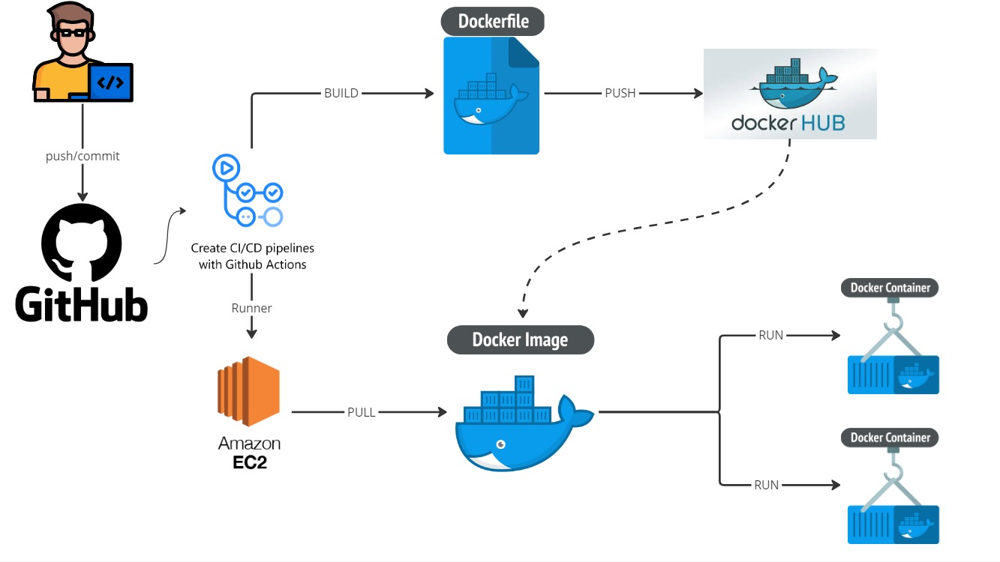

Available endpoints:

- http://localhost:8080/v1/compras
- http://localhost:8080/v1/maior_compra/{{year}}
- http://localhost:8080/v1/clientes_fieis
- http://localhost:8080/v1/recomendacao/cliente/tipo

Mock: 
- ProductDetails:`https://rgr3viiqdl8sikgv.public.blob.vercel-storage.com/produtos-mnboX5IPl6VgG390FECTKqHsD9SkLS.json`
- CustomerPurchases: `https://rgr3viiqdl8sikgv.public.blob.vercel-storage.com/clientes-Vz1U6aR3GTsjb3W8BRJhcNKmA81pVh.json`

Create a microservice whith the following endpoints after consumming the mocks above and return the requests bellow:

Pojo: `name, document, products details, total purchase quantities and values.`
- `GET /compras` - Return the purchases ordered ascending by value.
- `GET /maior-compra/{ano}` - Return the greatest purchase for the year.
- `GET /clientes-fieis` - Return top 3 loyal customers with the greatest recurring purchases.

Pojo: `name, document, recomendation, total purchase quantities and values.`
- `GET /recomendacao/cliente/tipo` - Return a recommendation of wine based in the types of customer most buy.

